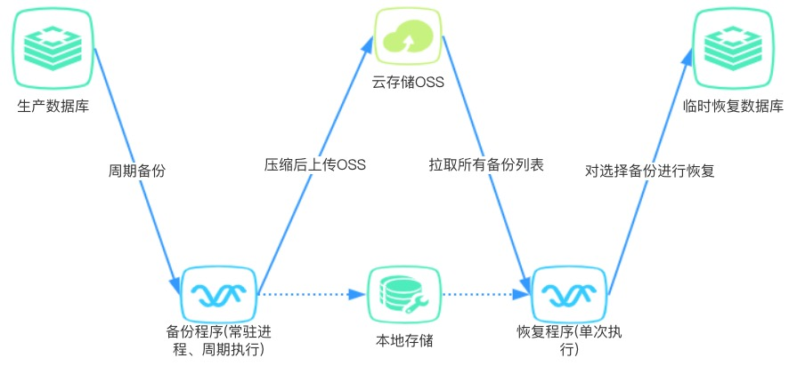

# 概述

【方案总体框架】



【备份过程】：

- 读取配置文件(config.yml)
- 自己执行cron，不再调用操作系统的cron，减少操作步骤
- 根据执行任务，执行mongodump,并压缩为'%Y-%m-%d-%H-%M-%S.gz'
- 上传oss，按指定目录：oss备份根目录/任务名称/%Y-%m-%d-%H-%M-%S.gz
  + 压缩的文件可能会几十G，要支持断点续传
  + 上传后对过期文件进行删除

【恢复过程】:

- 用户执行`python restore.py`程序
- 用户：输入目标数据库的uri，程序：验证联通性，返回结果，否则继续输入
- 程序拉取执行任务列表，让用户选择
- 程序拉取备份文件列表，让用户选择
- 程序先解冻，在下载备份文件，
- 程序执行mongrestore,完毕后退出

# quickstart
配置参见 [config.yml](./config.sample.yml)

1、立即支持某次备份任务（测试场景下使用）
```
python backup.py 任务名称  
```
2、 启动驻场程序，周期备份
```
python main.py &
```
3、 恢复备份
```
python restore.py & 
```
